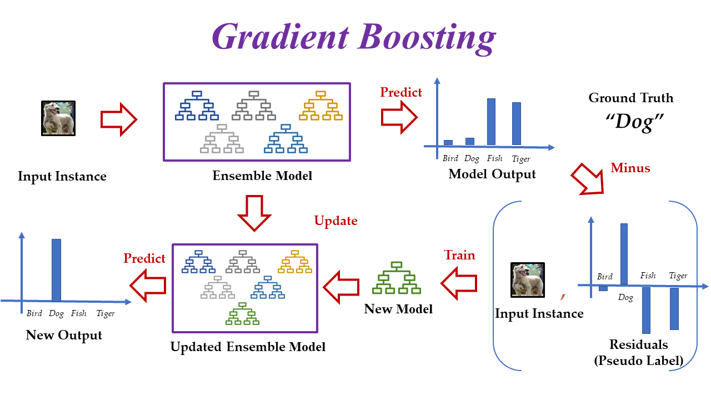
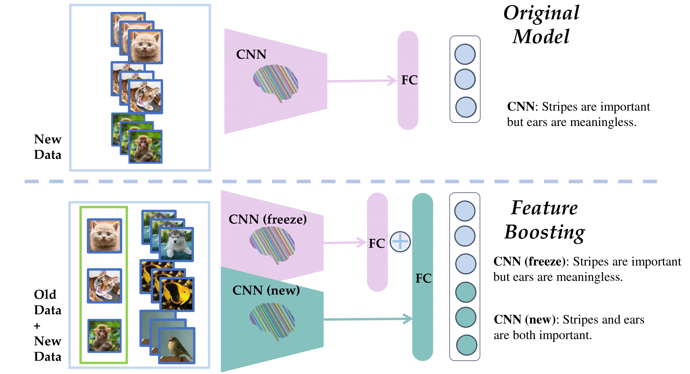
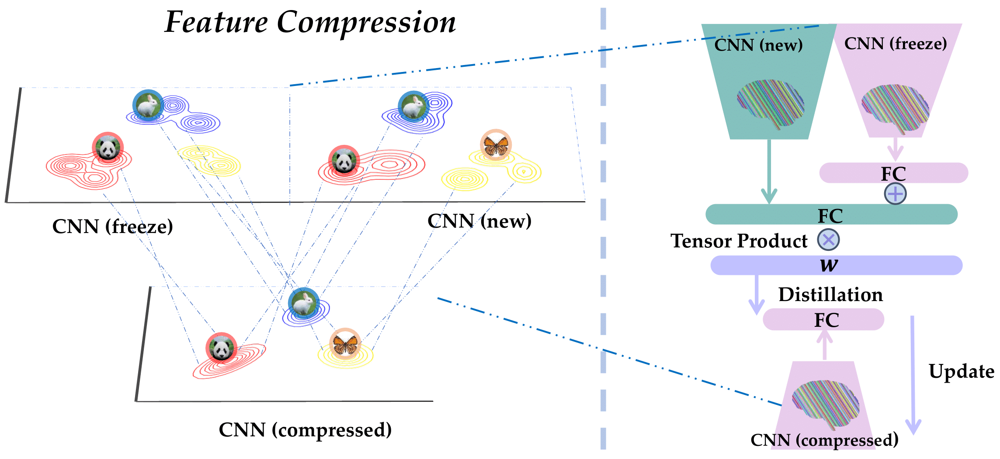
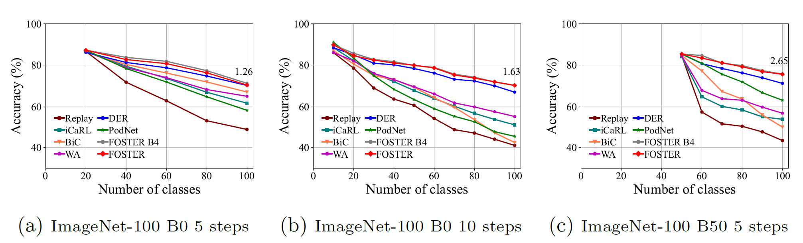
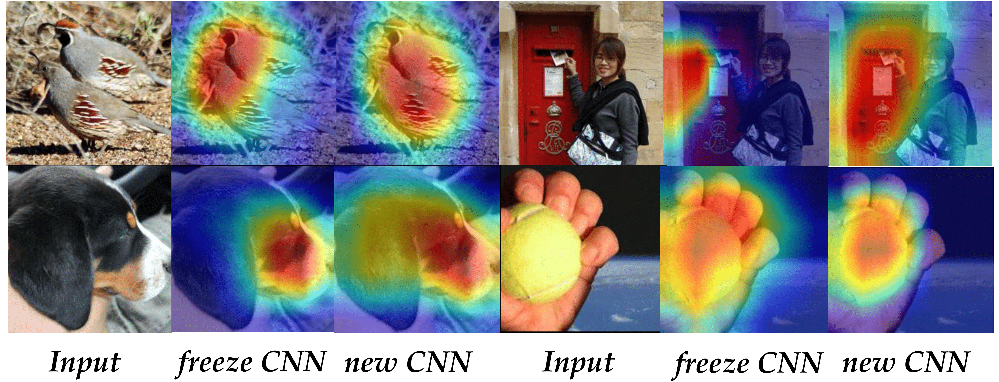

# FOSTER: Feature Boosting and Compression for Class-Incremental Learning

[](https://github.com/yaoyao-liu/class-incremental-learning/blob/master/LICENSE)[](https://www.python.org/) [](https://pytorch.org/)[](https://paperswithcode.com/task/incremental-learning)

The code repository for "Feature Boosting and Compression for Class-Incremental Learning
" [[paper]](https://arxiv.org/abs/2204.04662) (ECCV22) in PyTorch. If you use any content of this repo for your work, please cite the following bib entry:

    @article{wang2022foster,
      title={FOSTER: Feature Boosting and Compression for Class-Incremental Learning},
      author={Wang, Fu-Yun and Zhou, Da-Wei and Ye, Han-Jia and Zhan, De-Chuan},
      journal={arXiv preprint arXiv:2204.04662},
      year={2022}
    }

## Feature Boosting and Compression for Class-Incremental Learning

*The ability to learn new concepts continually is necessary in this ever-changing world. However, deep neural networks suffer from catastrophic forgetting when learning new categories. Many works have been proposed to alleviate this phenomenon, whereas most of them either fall into the stability-plasticity dilemma or take too much computation or storage overhead.  Inspired by the gradient boosting algorithm to gradually fit the residuals between the target and the current approximation function, we propose a novel two-stage learning paradigm FOSTER, empowering the model to learn new categories adaptively.*

***Gradient Boosting***. we propose a novel perspective from gradient boosting to analyze and achieve the goal of class-incremental learning. Gradient boosting methods use the additive model to gradually converge the ground-truth target model where the subsequent one fits the residuals between the target and the prior one.

<p align="center">

</p>
***Feature Boosting***.  First, we create a new module to fit the residual between targets and the output of the original model, following the principle of gradient boosting. With reasonable simplification and deduction,  the optimization objective is transformed into the minimization of KL divergence of the target and the output of the concatenated model. To alleviate the classification bias caused by imbalanced training, we proposed logits alignment to balance the training of old and new classes.

<p align="center">

</p>
***Feature Compression***. In the second step, we aim to eliminate redundant parameters and meaningless dimensions caused by feature boosting. To achieve this goal, we propose an effective distillation strategy that can transfer knowledge from the boosting model to a single model with negligible performance loss, even if the data is limited when learning new tasks.

<p align="center">

</p>

## Results

 Experimental results show that our method achieves state-of-the-art performance.

**Results on CIFAR-100**

| Protocols    | Reproduced Avg | Reported Avg |
| ------------ | -------------- | ------------ |
| B0 5 steps   | 73.88          | 72.54        |
| B0 10 steps  | 73.10          | 72.90        |
| B0 20 steps  | 70.59          | 70.65        |
| B50 5 steps  | 71.08          | 70.10        |
| B50 10 steps | 68.61          | 67.95        |
| B50 25 steps | 64.95          | 63.83        |
| B50 50 steps | 59.96          | -            |




We visualize the grad-CAM before and after feature boosting. As shown in the figure~(top-left), the freeze CNN only focuses on the head of the birds, ignoring the rest of their bodies, while the new CNN learns that the whole body is important for classification, which is consistent with our claim. Similarly, the middle and right figures show that the new CNN also discovers some essential but ignored patterns of the mailbox, the dog, and the tennis.



Please refer to our [[paper]](https://arxiv.org/abs/2204.04662)  for detailed results.


## Prerequisites

The following packages are required to run the scripts:

- [torch](https://github.com/pytorch/pytorch)
- [torchvision](https://github.com/pytorch/vision)
- [tqdm](https://github.com/tqdm/tqdm)
- [numpy](https://github.com/numpy/numpy)

## Training scripts

- Train CIFAR-100

  ```
  python main.py --config=./configs/cifar/b0inc10.json
  ```
- Train ImageNet-100

  ```
  python main.py --config=./configs/foster-imagenet100.json
  ```
- Train FOSTER-RMM

  ```
  python main.py --config=./configs/foster-rmm.json
  ```


Remember to change `YOURDATAROOT` into your own data root, or you will encounter errors.

## Acknowledgment

We thank the following repos for providing helpful components/functions in our work.

- [PyCIL: A Python Toolbox for Class-Incremental Learning](https://github.com/G-U-N/PyCIL)
- [Proser](https://github.com/zhoudw-zdw/CVPR21-Proser)
- [AutoAugment](https://github.com/DeepVoltaire/AutoAugment)

## Contact

If there are any questions, please feel free to contact with the author:  Fu-Yun Wang (wangfuyun@smail.nju.edu.cn). Enjoy the code.
